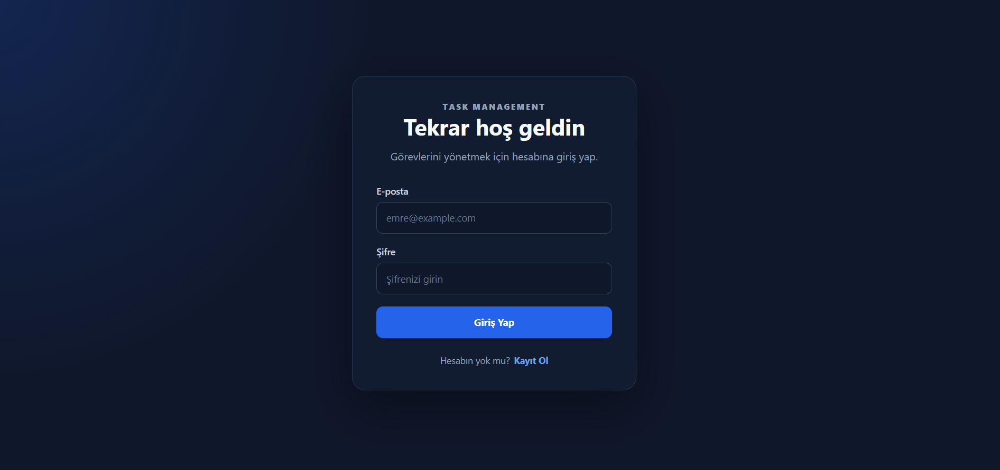
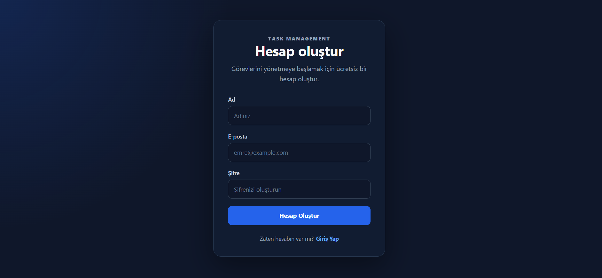
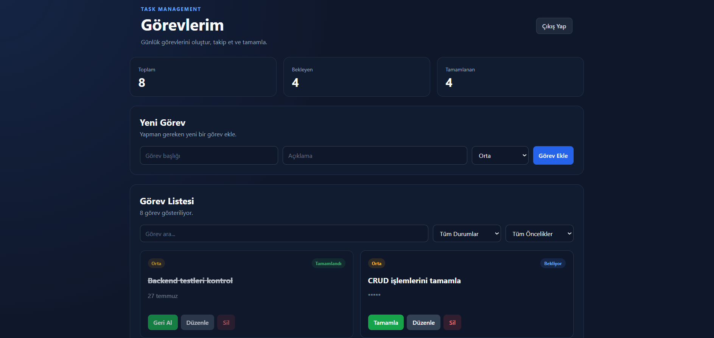

# Task Management Frontend

A modern task management web application built with React and Vite.

This project provides a user-friendly frontend interface for the Task Management API. Users can create accounts, log in securely, and manage their personal tasks.

## Features

- User registration
- User login
- JWT-based authentication
- Protected dashboard routes
- Create tasks
- Edit tasks
- Delete tasks
- Mark tasks as completed
- Reopen completed tasks
- Search tasks
- Filter tasks by status
- Filter tasks by priority
- Responsive user interface
- REST API integration

## Technologies

- React
- Vite
- JavaScript
- React Router
- Axios
- CSS
- REST API
- JWT Authentication

## Project Structure

```text
src/
├── api/
│   └── api.js
├── components/
│   └── ProtectedRoute.jsx
├── pages/
│   ├── Dashboard.jsx
│   ├── Login.jsx
│   └── Register.jsx
├── App.jsx
├── App.css
├── Auth.css
├── index.css
└── main.jsx
```

## Authentication

The application uses JWT authentication.

After a successful login, the JWT token is stored in the browser and automatically included in authenticated API requests.

Protected routes prevent unauthenticated users from accessing the dashboard.

## Task Management

Users can manage their own tasks through the dashboard.

Each task can contain:

- Title
- Description
- Priority
- Completion status

Available priority levels:

- Low
- Medium
- High

Tasks can be created, updated, completed, reopened, searched, filtered, and deleted.

## Backend

This frontend communicates with a separate Node.js and Express REST API.

The backend includes:

- Express.js
- Microsoft SQL Server
- JWT Authentication
- REST API
- CRUD operations
- Request validation
- Swagger API documentation

## Installation

Clone the repository:

```bash
git clone <repository-url>
```

Navigate to the project:

```bash
cd task-management-frontend
```

Install dependencies:

```bash
npm install
```

Start the development server:

```bash
npm run dev
```

The application will normally run at:

```text
http://localhost:5173
```

## API Configuration

The frontend communicates with the backend through Axios.

During local development, the backend is expected to run at:

```text
http://localhost:3000
```

The API configuration can be found in:

```text
src/api/api.js
```

## Screenshots

Screenshots of the application will be added here.

### Login



### Register



### Dashboard



## Future Improvements

- Due date support
- Task sorting
- User profile page
- Improved dashboard statistics
- Light/dark theme support
- Deployment
- Additional responsive improvements

## Author

**Emre Şenkaya**

Computer Engineering Student

GitHub: EmreSenkaya-1713